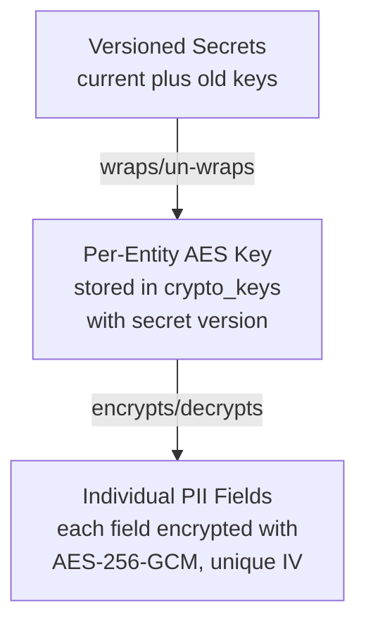

# Crypto-Shredding & GDPR

The event store implements **envelope encryption** for GDPR-compliant PII handling. Per-entity encryption keys allow surgical data erasure by revoking a single key, making all PII for that entity irrecoverable without touching any other data.

## Architecture



**Two-layer envelope encryption:**

1. The first configured **versioned secret** encrypts new per-entity AES keys; later secrets decrypt existing keys after rotation.
2. Each entity (e.g., a user) gets its own **AES-256-GCM key** stored encrypted in the `crypto_keys` table.
3. Individual PII fields within event data are encrypted with the entity's key, each with a unique random IV.

## How It Works

### Write Path (append)

1. For each event with `encryptedFields` + `cryptoKeyId`, the entity's AES key is retrieved and decrypted from the DB using the configured secret version.
2. Each PII field (specified as dot-paths, e.g. `"address.street"`) is:
   - Extracted from the event data
   - JSON-stringified and encrypted with AES-256-GCM (random IV per field)
   - Stored in the `encrypted_data` column as `{ version, ciphertext, iv, authTag }` (base64-encoded)
3. The `data` column stores the event payload **with PII fields removed**.

**Example of what gets stored in the database:**

```
data column:            { "loginCount": 5 }
encrypted_data column:  { "name": { "version": 2, "ciphertext": "...", "iv": "...", "authTag": "..." },
                          "email": { "version": 2, "ciphertext": "...", "iv": "...", "authTag": "..." } }
crypto_key_id column:   "user:abc123"
```

### Read Path (load)

1. If the entity's crypto key is **active**: fields are decrypted and merged back into the event data. The caller sees the complete event as if encryption was transparent.
2. If the key is **revoked or missing**: the event is returned as a `TombstonedEvent` with `data: null` and `tombstoned: true`.

## Setting Up Encryption

### 1. Configure Versioned Secrets

Generate secret values for the versions you will use:

```bash
openssl rand -base64 32
```

Configure the current secret first. Older entries are decryption-only:

```typescript
const eventStore = new EventStore({
  pool,
  secrets: [
    { version: 2, value: process.env.GDPR_CRYPTO_SECRET_V2! },
    { version: 1, value: process.env.GDPR_CRYPTO_SECRET_V1! },
  ],
});
```

The same configuration can be supplied through the environment:

```bash
GDPR_CRYPTO_SECRETS=2:new-secret-base64,1:old-secret-base64
```

Secret values are strings. Keep every old secret needed to read existing data
until that data has been intentionally retired; removing a configured version
makes envelopes using it unreadable.

### 2. Create Entity Keys

Create a per-entity key before appending encrypted events:

```typescript
await eventStore.createCryptoKey("user:abc123");
```

This is **idempotent** — if the key already exists, it's a no-op.

### 3. Configure Aggregate Encryption

In the aggregate definition, specify which fields contain PII per event type:

```typescript
type UserState = {
  name: string;
  email: string;
  address: { street: string; city: string };
};

const User = defineAggregate<UserState, UserEvents>()({
  streamPrefix: "User",
  // ... evolve ...

  encryption: {
    cryptoKeyId: (entityId) => `user:${entityId}`,
    encryptedFields: {
      UserRegistered: ["name", "email", "address.street"],
      UserRenamed: ["name"],
    },
  },
});
```

### 4. Or Use Low-Level API

If not using aggregates, specify encryption per-event in the `append` call:

```typescript
await eventStore.append({
  streamId: "User-abc123",
  expectedVersion: 0,
  events: [
    {
      type: "UserRegistered",
      data: { name: "Alice", email: "alice@example.com", loginCount: 0 },
      encryptedFields: ["name", "email"],
      cryptoKeyId: "user:abc123",
    },
  ],
});
```

## Dot-Path Field Notation

Encrypted fields are specified using dot-path notation for nested objects:

```typescript
encryptedFields: ["name", "address.street", "address.city"];
```

Given event data:

```json
{
  "name": "Alice",
  "address": { "street": "123 Main", "city": "Berlin" },
  "active": true
}
```

After encryption, `data` column contains:

```json
{ "address": {}, "active": true }
```

And `encrypted_data` column contains:

```json
{
  "name": { "ciphertext": "...", "iv": "...", "authTag": "..." },
  "address.street": { "ciphertext": "...", "iv": "...", "authTag": "..." },
  "address.city": { "ciphertext": "...", "iv": "...", "authTag": "..." }
}
```

## Rotating Secrets Without Downtime

To rotate from version `1` to version `2`, deploy the new configuration with
version `2` first and version `1` second:

```typescript
secrets: [
  { version: 2, value: "new-secret" },
  { version: 1, value: "old-secret" },
];
```

New entity-key envelopes and encrypted fields use version `2`. Existing
version `1` envelopes are decrypted by direct version lookup and are not
rewritten during reads. The next append for an entity lazily re-wraps its
entity key with version `2`; no event rewrite, database migration, or downtime
is required.

**Migration warning:** deploy the new secret configuration before removing the
old secret. Removing a secret version makes envelopes using it permanently
unreadable. Keep each secret version until all data encrypted with it has been
retired.

## GDPR Right to Erasure

The complete flow for handling a user deletion request:

```typescript
// 1. When user registers — create their crypto key
await eventStore.createCryptoKey("user:abc123");

// 2. Normal operation — append events with encrypted PII
await User.append(eventStore, {
  entityId: "abc123",
  expectedVersion: -1,
  events: [
    {
      type: "UserRegistered",
      data: {
        name: "Alice",
        email: "alice@example.com",
        address: { street: "123 Main", city: "Berlin" },
      },
    },
  ],
});

// 3. User requests deletion — revoke the key
await eventStore.revokeKey("user:abc123");

// 4. All future reads return tombstones for encrypted events
const user = await User.load(eventStore, "abc123");
// user.state contains the result of your null-safe evolve handlers
```

### What `revokeKey` Does

Within a single transaction:

1. Sets `revoked_at = now()` on the crypto key (the key is **not deleted** — kept for audit trail)

The key is never deleted from the database. This is intentional — the `revoked_at` timestamp provides an audit trail for GDPR compliance.

## Tombstoned Events

After key revocation, encrypted events are returned as `TombstonedEvent`:

```typescript
interface TombstonedEvent {
  globalPosition: bigint;
  streamId: string;
  streamVersion: number;
  type: string; // Event type name — you know what happened
  data: null; // PII shredded — irrecoverable
  extensions: object; // Extensions are NOT encrypted
  createdAt: Date;
  tombstoned: true;
}
```

**Important characteristics:**

- `data` is `null` — the PII is cryptographically irrecoverable
- `extensions` is still available (it's never encrypted)
- `type` is still available — you know _what_ happened, just not _the PII details_
- Non-encrypted events in the same stream are **not affected**

### Handling Tombstones in Evolve Handlers

Evolve handlers **must** use optional chaining with fallbacks:

```typescript
evolve: {
  UserRegistered: (state, event) => ({
    ...state,
    name: event.data?.name ?? state.name,
    email: event.data?.email ?? state.email,
    active: event.data?.active ?? state.active,
  }),
}
```

## Error Handling

| Error                        | When                                                        | Recovery                                      |
| ---------------------------- | ----------------------------------------------------------- | --------------------------------------------- |
| `CryptoKeyRevokedError`      | Trying to encrypt **new** events with a revoked key         | Do not write PII for deleted users            |
| `CryptoKeyNotFoundError`     | Crypto key does not exist in the key store                  | Create the key first with `createCryptoKey()` |
| `CryptoSecretsRequiredError` | Crypto operation without `secrets` or `GDPR_CRYPTO_SECRETS` | Provide configured secrets                    |

`CryptoKeyRevokedError` is only thrown on **write** operations. On **read**, revoked keys simply produce tombstoned events without throwing.

## Security Details

- **Algorithm:** AES-256-GCM (authenticated encryption) for both master-to-entity and entity-to-field encryption
- **IV:** 12 bytes, randomly generated per encryption operation
- **Auth tag:** 16 bytes
- **Entity key storage format:** versioned envelope `[magic][secret version][iv][authTag][ciphertext]` stored as `BYTEA`
- **Field storage format:** `{ version, ciphertext, iv, authTag }` as base64 strings in `JSONB`
- **Key cache:** Decrypted entity keys are cached in a per-read-call `Map` (not across requests) to avoid redundant DB lookups within a single stream load
