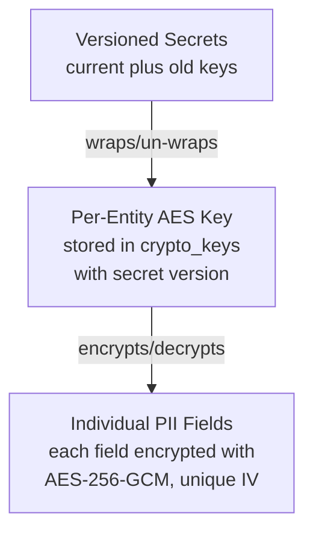

# Crypto-Shredding & GDPR

The event store implements **envelope encryption** for GDPR-compliant PII handling. Per-entity encryption keys allow surgical data erasure by revoking a single key, making all PII for that entity irrecoverable without touching any other data.

## Alternative: Keep PII Outside the Event Store

Crypto-shredding is not the only way to support the GDPR right to erasure. A
simpler option is to keep personal data in regular application tables and store
only an opaque reference to the person in each event. For example, an event can
contain `personId: "person_abc123"`, while the corresponding name, email, and
address live in a `persons` table.

```sql
CREATE TABLE persons (
  person_id TEXT PRIMARY KEY,
  name TEXT NOT NULL,
  email TEXT NOT NULL,
  address JSONB NOT NULL
);

-- The event payload contains only the reference and non-personal data:
-- { "personId": "person_abc123", "orderId": "order_42" }
```

When a person requests erasure, delete their row (and any related PII rows)
using the application's normal database transaction and retain the events. The
event history remains available for auditing and replay, but the reference no
longer resolves to personal data:

```typescript
await db.transaction(async (tx) => {
  await tx.query("DELETE FROM person_addresses WHERE person_id = $1", [personId]);
  await tx.query("DELETE FROM persons WHERE person_id = $1", [personId]);
});
```

This approach avoids key management, encrypted-field configuration, and
tombstoned events. It is a good fit when events need to preserve business facts
but not a self-contained copy of personal details. For example, an
`OrderPlaced` event can retain the `personId`, order amount, and product IDs;
after erasure, those order facts can still be replayed, but the person's name
and email cannot be resolved. Consumers must handle missing references
explicitly, and writes to the PII table and the event store should be
coordinated so an event cannot point to a person that was never persisted.

With this approach, personal details are unavailable whenever the reference
cannot be resolved. With crypto-shredding, PII embedded in events remains
readable while the key is active and becomes irrecoverable only after the key is
revoked.

An identifier is not automatically anonymous merely because it is called an
ID. Use an opaque, non-semantic identifier and assess whether it can be linked
back to a person in your system. Keep personal data out of event extensions,
logs, projections, snapshots, caches, and other copied representations as
well. Database backups, replicas, and WAL archives still require their own
retention and deletion policies.

Use this reference-based design when deleting the PII record is sufficient for
your retention requirements. Use [crypto-shredding](#gdpr-right-to-erasure)
when PII must remain embedded in event payloads while becoming irrecoverable on
erasure.

## Architecture


```mermaid
graph TD
  MK[Versioned Secrets\ncurrent plus old keys] -->|wraps/un-wraps| EK[Per-Entity AES Key\nstored in crypto_keys\nwith secret version]
  EK -->|encrypts/decrypts| PII[Individual PII Fields\neach field encrypted with\nAES-256-GCM, unique IV]
```

**Two-layer envelope encryption:**

1. The configured `currentVersion` secret encrypts new per-entity AES keys; the
   remaining configured secrets decrypt existing keys after rotation.
2. Each entity (e.g., a user) gets its own **AES-256-GCM key** stored encrypted in the `crypto_keys` table.
3. Individual PII fields within event data are encrypted with the entity's key, each with a unique random IV.

AES-GCM also authenticates the meaning of each encrypted value. Entity-key
envelopes are bound to their key ID, magic marker, and secret version. PII
fields are bound to their event ID, entity-key ID, field path, and stored
version. Moving a valid ciphertext to another row, event, or field therefore
causes decryption to fail.

## How It Works

### Write Path (append)

1. For each event with `encryptedFields` + `cryptoKeyId`, the entity's AES key is retrieved and decrypted from the DB using the configured secret version.
2. Each PII field (specified as dot-paths, e.g. `"address.street"`) is:
   - Extracted from the event data
   - JSON-stringified and encrypted with AES-256-GCM (random IV per field)
   - Stored in the `encrypted_data` column as `{ version, ciphertext, iv, authTag }` (base64-encoded)
3. The `data` column stores the event payload **with PII fields removed**.

**Example of what gets stored in the database:**

```
data column:            { "loginCount": 5 }
encrypted_data column:  { "name": { "version": 2, "ciphertext": "...", "iv": "...", "authTag": "..." },
                          "email": { "version": 2, "ciphertext": "...", "iv": "...", "authTag": "..." } }
crypto_key_id column:   "user:abc123"
```

### Read Path (load)

1. If the entity's crypto key is **active**: fields are decrypted and merged back into the event data. The caller sees the complete event as if encryption was transparent.
2. If the key is **revoked or missing**: the event is returned as a `TombstonedEvent` with `data: null` and `tombstoned: true`.

## Setting Up Encryption

### 1. Configure Versioned Secrets

Generate secret values for the versions you will use:

```bash
openssl rand -base64 32
```

Configure the complete keyring and explicitly select the version used for new
encryption. The order of entries is not significant:

```typescript
const eventStore = new EventStore({
  pool,
  secrets: {
    currentVersion: 2,
    secrets: [
      { version: 1, value: process.env.GDPR_CRYPTO_SECRET_V1! },
      { version: 2, value: process.env.GDPR_CRYPTO_SECRET_V2! },
    ],
  },
});
```

The same configuration can be supplied through the environment:

```bash
GDPR_CRYPTO_SECRETS=2:new-secret-base64,1:old-secret-base64
GDPR_CRYPTO_CURRENT_VERSION=2
```

Secret values are strings. All values are strengthened with `scrypt` to derive
the 32-byte key used to protect entity keys. Use a high-entropy generated value;
`scrypt` makes guessing more expensive but cannot add entropy to a weak secret.
Keep every old secret needed to read existing versioned envelopes until that
data has been intentionally retired; removing a configured version makes those
envelopes unreadable.

Secret versions are unsigned 32-bit integers from `0` to `4294967295`. Gaps are
allowed, and `currentVersion` must identify one of the configured secrets. Use a
higher version for each new rotation, but do not encode the active version by
reordering the keyring.

> **Format warning:** This release intentionally supports only authenticated,
> versioned crypto envelopes. It does not read records created by earlier
> pre-release implementations. Start with an empty crypto database, or recreate
> development and test data, before adopting this format. Rotating between
> secret versions in this format does not require a database migration.

### 2. Create Entity Keys

Create a per-entity key before appending encrypted events:

```typescript
await eventStore.createCryptoKey("user:abc123");
```

This is **idempotent** — if the key already exists, it's a no-op.

### 3. Configure Aggregate Encryption

In the aggregate definition, specify which fields contain PII per event type:

```typescript
type UserState = {
  name: string;
  email: string;
  address: { street: string; city: string };
};

const User = defineAggregate<UserState, UserEvents>()({
  streamPrefix: "User",
  // ... evolve ...

  encryption: {
    cryptoKeyId: (entityId) => `user:${entityId}`,
    encryptedFields: {
      UserRegistered: ["name", "email", "address.street"],
      UserRenamed: ["name"],
    },
  },
});
```

### 4. Or Use Low-Level API

If not using aggregates, specify encryption per-event in the `append` call:

```typescript
await eventStore.append({
  streamId: "User-abc123",
  expectedVersion: 0,
  events: [
    {
      type: "UserRegistered",
      data: { name: "Alice", email: "alice@example.com", loginCount: 0 },
      encryptedFields: ["name", "email"],
      cryptoKeyId: "user:abc123",
    },
  ],
});
```

## Dot-Path Field Notation

Encrypted fields are specified using dot-path notation for nested objects:

```typescript
encryptedFields: ["name", "address.street", "address.city"];
```

Given event data:

```json
{
  "name": "Alice",
  "address": { "street": "123 Main", "city": "Berlin" },
  "active": true
}
```

After encryption, `data` column contains:

```json
{ "address": {}, "active": true }
```

And `encrypted_data` column contains:

```json
{
  "name": { "version": 2, "ciphertext": "...", "iv": "...", "authTag": "..." },
  "address.street": {
    "version": 2,
    "ciphertext": "...",
    "iv": "...",
    "authTag": "..."
  },
  "address.city": {
    "version": 2,
    "ciphertext": "...",
    "iv": "...",
    "authTag": "..."
  }
}
```

## Rotating Secrets Without Downtime

For a single application instance, add the new version to the keyring and set
it as `currentVersion`. For an HA or rolling deployment, use two phases so every
replica can read version `2` before any replica writes it.

> **Backup recommendation:** A restorable backup of the event-store database
> before every secret rotation is strongly recommended. Verify that the backup
> includes both `events` and `crypto_keys`, and keep the old secret securely
> available until the rollout and recovery procedure have been verified. A
> database backup without its corresponding secret cannot decrypt encrypted
> entity keys.

### Phase 1: distribute the new secret

Deploy this configuration to every replica while version `1` remains current:

```typescript
secrets: {
  currentVersion: 1,
  secrets: [
    { version: 1, value: "old-secret" },
    { version: 2, value: "new-secret" },
  ],
};
```

Wait until all replicas have this configuration. They continue writing version
`1`, but all of them can decrypt version `2`.

### Phase 2: activate the new secret

After phase 1 is complete, keep the same keyring and change only the active
version:

```typescript
secrets: {
  currentVersion: 2,
  secrets: [
    { version: 1, value: "old-secret" },
    { version: 2, value: "new-secret" },
  ],
};
```

New entity-key envelopes and encrypted fields use version `2`. A replica still
on phase 1 can read a version `2` envelope and will never downgrade it back to
version `1`. Existing version `1` envelopes are decrypted by direct version
lookup and are not rewritten during reads. The next append for an entity lazily
re-wraps only its entity key with version `2`; existing event ciphertext is not
rewritten. No full database migration or downtime is required.

### Removing the old secret

Do not remove version `1` merely because phase 2 finished. Lazy rotation means
an inactive entity may keep a version `1` envelope indefinitely. Before removal,
verify that no active entity-key envelope still uses it:

```sql
SELECT
  get_byte(encrypted_key, 4)::bigint * 16777216
    + get_byte(encrypted_key, 5)::bigint * 65536
    + get_byte(encrypted_key, 6)::bigint * 256
    + get_byte(encrypted_key, 7)::bigint AS secret_version,
  count(*)
FROM event_store.crypto_keys
WHERE revoked_at IS NULL
GROUP BY secret_version
ORDER BY secret_version;
```

Use your configured schema instead of `event_store`. Keep the old secret until
the old version count is zero, retain it indefinitely, or intentionally retire
the remaining data. An inactive key is not automatically rewrapped by reads.

**Migration warning:** deploy the new secret configuration before removing the
old secret. Removing a secret version makes envelopes using it permanently
unreadable.

## GDPR Right to Erasure

The complete flow for handling a user deletion request:

```typescript
// 1. When user registers — create their crypto key
await eventStore.createCryptoKey("user:abc123");

// 2. Normal operation — append events with encrypted PII
await User.append(eventStore, {
  entityId: "abc123",
  expectedVersion: -1,
  events: [
    {
      type: "UserRegistered",
      data: {
        name: "Alice",
        email: "alice@example.com",
        address: { street: "123 Main", city: "Berlin" },
      },
    },
  ],
});

// 3. User requests deletion — revoke the key
await eventStore.revokeKey("user:abc123");

// 4. All future reads return tombstones for encrypted events
const user = await User.load(eventStore, "abc123");
// user.state contains the result of your null-safe evolve handlers
```

### What `revokeKey` Does

Within a single transaction:

1. Sets `revoked_at = now()` on the crypto key.
2. Sets `encrypted_key = NULL`, permanently removing the database copy of the wrapped entity key.

The crypto-key row remains only to retain non-sensitive audit metadata such as
`key_id`, `revoked_at`, `algorithm`, and `created_at`. Revocation is idempotent:
repeating it keeps the row tombstoned and the key material absent.

Appends lock the entity-key row until their transaction commits. Revocation
uses the same PostgreSQL row lock, so the ordering is safe across multiple
application replicas: an append that acquired the lock first commits before
revocation, while an append that starts after revocation sees the revoked key
and fails with `CryptoKeyRevokedError`.

## Erasure limitations

This destroys the key material in the live database and prevents recovery with
any currently configured secret. It cannot erase copies already captured in
database backups, replicas, WAL archives, caches, logs, memory, or secret
backups. Retention and deletion policies for those systems must be managed
separately. Any future encryption or algorithm migration job must exclude rows
where `revoked_at IS NOT NULL`.

## Tombstoned Events

After key revocation, encrypted events are returned as `TombstonedEvent`:

```typescript
interface TombstonedEvent {
  globalPosition: bigint;
  streamId: string;
  streamVersion: number;
  type: string; // Event type name — you know what happened
  data: null; // PII shredded — irrecoverable
  extensions: object; // Extensions are NOT encrypted
  createdAt: Date;
  tombstoned: true;
}
```

**Important characteristics:**

- `data` is `null` — the PII is cryptographically irrecoverable
- `extensions` is still available (it's never encrypted)
- `type` is still available — you know _what_ happened, just not _the PII details_
- Non-encrypted events in the same stream are **not affected**

### Handling Tombstones in Evolve Handlers

Evolve handlers **must** use optional chaining with fallbacks:

```typescript
evolve: {
  UserRegistered: (state, event) => ({
    ...state,
    name: event.data?.name ?? state.name,
    email: event.data?.email ?? state.email,
    active: event.data?.active ?? state.active,
  }),
}
```

## Error Handling

| Error                        | When                                                                 | Recovery                                      |
| ---------------------------- | -------------------------------------------------------------------- | --------------------------------------------- |
| `CryptoKeyRevokedError`      | Trying to encrypt **new** events with a revoked key                  | Do not write PII for deleted users            |
| `CryptoKeyNotFoundError`     | Crypto key does not exist in the key store                           | Create the key first with `createCryptoKey()` |
| `CryptoSecretsRequiredError` | Crypto operation without `secrets` or a complete environment keyring | Provide configured secrets                    |

`CryptoKeyRevokedError` is only thrown on **write** operations. On **read**, revoked keys simply produce tombstoned events without throwing.

## Security Details

- **Algorithm:** AES-256-GCM (authenticated encryption) for both secret-to-entity and entity-to-field encryption
- **IV:** 12 bytes, randomly generated per encryption operation
- **Auth tag:** 16 bytes
- **Entity key storage format:** versioned envelope `[magic][secret version][iv][authTag][ciphertext]` stored as `BYTEA`; the header and key ID are authenticated as AAD
- **Field storage format:** `{ version, ciphertext, iv, authTag }` as base64 strings in `JSONB`; event ID, key ID, field path, and version are authenticated as AAD
- **Key cache:** Decrypted entity keys are cached in a per-read-call `Map` (not across requests) to avoid redundant DB lookups within a single stream load
