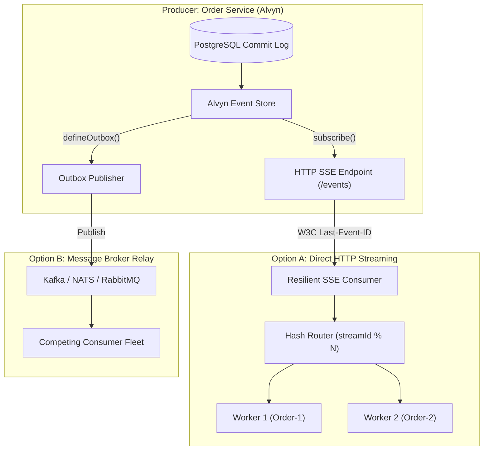
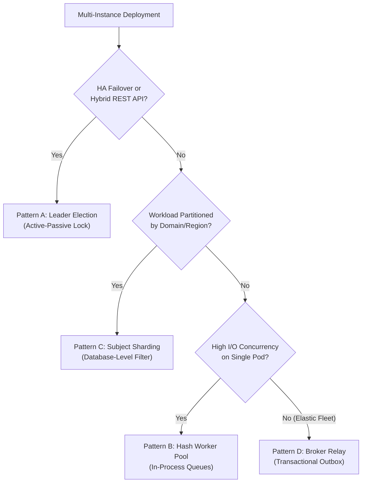
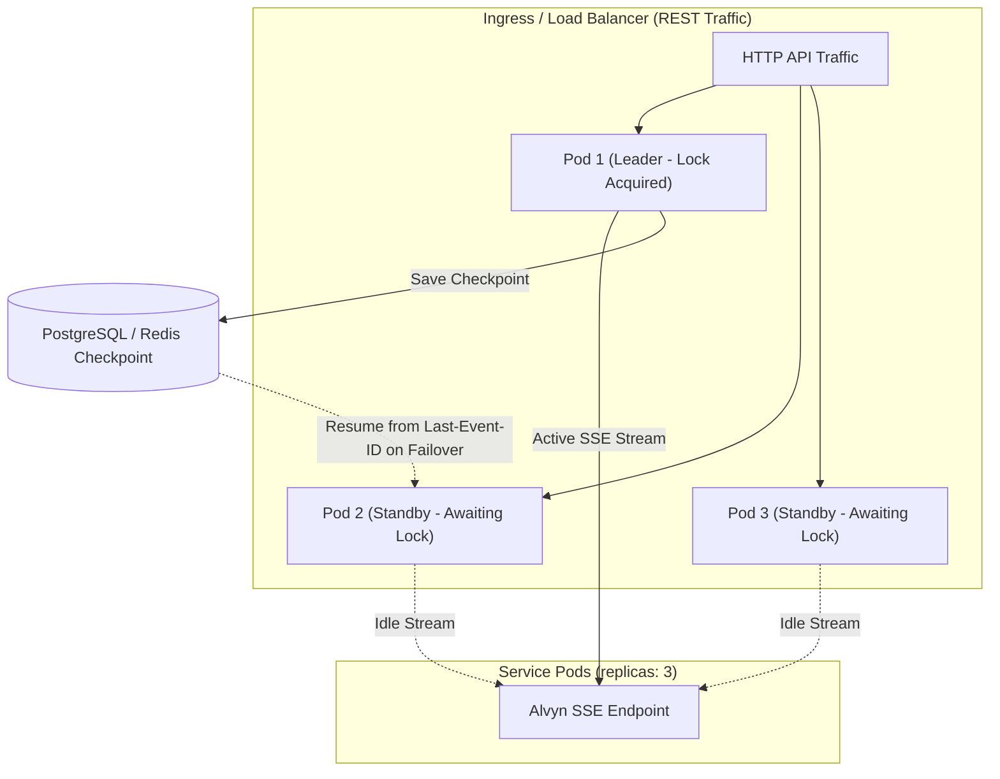
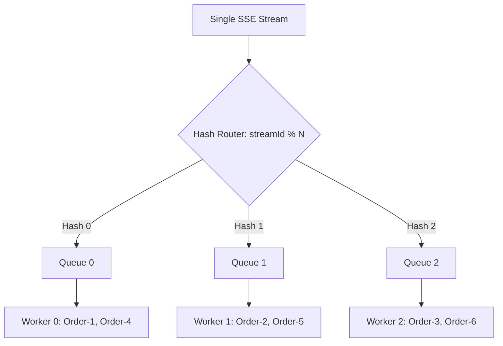
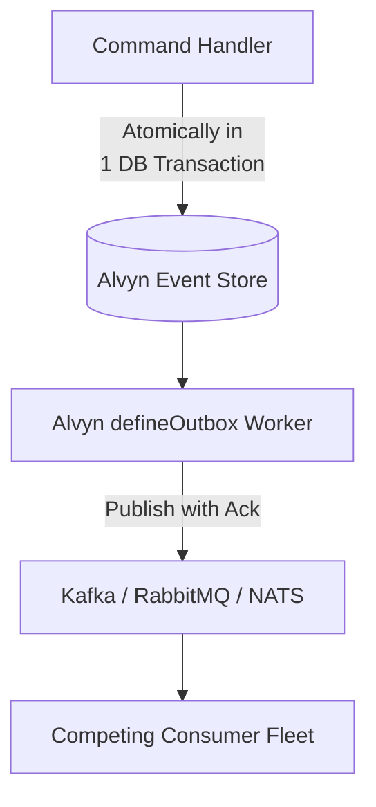

import { Callout } from "fumadocs-ui/components/callout";
import { Tab, Tabs } from "fumadocs-ui/components/tabs";

# Event Streaming & Resilient Consumer Playbook

Building distributed, event-driven microservices often brings architectural dilemmas: When is a dedicated message broker necessary, and when does it introduce accidental complexity? How do you stream events to downstream services reliably without data loss? And how do you handle Kubernetes consumer replica sets without duplicate processing or race conditions?

This playbook provides an architectural decision framework, hands-on TypeScript implementation guides, and production runbooks for real-time event streaming with **Alvyn**, **Server-Sent Events (SSE)**, and **Transactional Outbox relays**.



---

## 1. Architectural Blueprint: Direct Streaming vs. Message Brokers

A common reflex in event-driven architecture is to place an external message broker (like Apache Kafka, RabbitMQ, or NATS) between services as soon as events need to be shared. While brokers solve critical problems at scale, they also introduce operational overhead, client library dependencies, and potential consistency hurdles.

In an event-sourced architecture powered by **Alvyn**, PostgreSQL is already an immutable, ordered, append-only commit log. Understanding the trade-offs helps you choose the right communication model:

### Communication Models: Fan-Out vs. Competing Consumers

| Dimension | Direct HTTP Streaming (Alvyn + SSE) | Message Brokers (Kafka / RabbitMQ / NATS) |
| :--- | :--- | :--- |
| **Delivery Model** | **Fan-Out (Broadcast):** Every connected client receives all events matching its filter. | **Competing Consumers:** Broker distributes individual messages across worker pods in a consumer group. |
| **ReplicaSet Handling** | Requires client-side strategy (In-Process Worker Pool, Active-Passive Leader Lock, or Subject Sharding). | Built into the broker (partition assignment or queue round-robin). |
| **Protocol** | Standard HTTP/1.1 or HTTP/2 (`text/event-stream`). Accessible by any language, `curl`, or browser. | Proprietary binary protocols (AMQP, Kafka TCP wire protocol, NATS protocol). |
| **Infrastructure** | **Zero additional infrastructure:** Runs directly on your existing API Gateway and database. | Requires dedicated cluster deployment, monitoring, JVM/storage tuning, and backup routines. |
| **Historical Replay** | Native: Client reconnects with `Last-Event-ID: <position>` or requests `fromPosition: 0`. | Supported on log-based brokers (Kafka/Pulsar/JetStream); limited on classic queues. |
| **Dual-Write Risk** | **None:** Read directly from the source PostgreSQL database commit log. | Mitigated via Transactional Outbox pattern (`defineOutbox`). |

### When to Use Direct HTTP Streaming (Alvyn + SSE)

* **CQRS Read-Model Projections:** Replicating domain events to external databases (e.g., Elasticsearch, Redis, MongoDB).
* **Downstream Microservices & 3rd-Party APIs:** Allowing external partners or internal microservices to consume events using standard web standards without configuring VPNs or broker client libraries.
* **Low-to-Medium Fleet Complexity:** When consumers can process events using in-process concurrency or active-passive replica sets.
* **Operational Simplicity:** When you want to minimize the number of moving parts in your infrastructure stack.

### When to Introduce a Dedicated Message Broker

* **High-Volume Competing Consumers:** When hundreds of independent worker pods must pull work items from a shared queue in round-robin fashion.
* **Big Data & Analytics Pipelines:** Ingesting 200,000+ events per second into stream-processing engines like Apache Flink or Apache Spark (ideal for **Apache Kafka**).
* **Complex Transactional Task Queuing:** Fine-grained per-message TTLs, priority queues, and dead-letter exchanges (ideal for **RabbitMQ**).
* **Ultra-Low Latency RPC & Edge Computing:** Sub-millisecond synchronous request-reply and edge mesh synchronization via leaf nodes (ideal for **NATS JetStream**).

<Callout type="info">
**Alvyn supports both models:** You can stream events directly via `eventStore.subscribe()` over SSE, or use Alvyn's transactional outbox (`defineOutbox`) to relay events to Kafka, RabbitMQ, or NATS with guaranteed at-least-once delivery.
</Callout>

---

## 2. Core Primitives & Guarantees (Demystified)

Before implementing the streaming endpoints, let's look under the hood at how Alvyn ensures zero data loss during restarts and catch-up phases.

### Concept 1: The Monotonic Bookmark (`globalPosition`)

Every event written to Alvyn receives a database-generated `BIGSERIAL` sequence number called `globalPosition`. 

Unlike wall-clock timestamps (`createdAt`), which suffer from server clock skew, NTP adjustments, and transaction commit reordering, `globalPosition` is **strictly monotonic, gap-free, and unique**. It acts as an absolute bookmark: if a consumer has processed position `10522`, it has processed every event up to that point.

### Concept 2: The W3C SSE Standard (`Last-Event-ID`)

The W3C Server-Sent Events standard includes built-in resumption mechanics. When the server pushes an event, it includes an `id:` line:

```http
id: 10522
event: OrderPlaced
data: {"orderId":"ORD-99","total":89.99}
```

When a network drop occurs, compliant HTTP clients automatically attach the `Last-Event-ID` header upon reconnecting:

```http
GET /events HTTP/1.1
Host: api.example.com
Accept: text/event-stream
Last-Event-ID: 10522
```

### Concept 3: Alvyn's `lowerBound` Parameter

When invoking `eventStore.subscribe()`, you supply `lowerBound`:

```typescript
const stream = eventStore.subscribe({
  lowerBound: { id: "10522", type: "exclusive" },
});
```

This tells Alvyn: *"Resume immediately after position 10522 (`global_position > 10522`)."*

### Concept 4: The Zero-Gap Single Query Loop

Alvyn does **not** maintain separate systems for "historical catch-up" and "live listening". Instead, it executes a continuous cursor query against PostgreSQL:

```sql
SELECT * FROM events
WHERE global_position > $1 AND global_position <= $2
ORDER BY global_position ASC
LIMIT 500;
```

1. **Catch-Up Phase:** While the consumer's cursor (`$1`) is behind the database head, Alvyn fetches full 500-event batches via primary key index scans.
2. **Live Transition:** When a query returns fewer than 500 events, the consumer is caught up. Alvyn pauses on an internal waker tied to PostgreSQL `LISTEN/NOTIFY` (with a periodic polling fallback).
3. **Instant Wake-Up:** The instant a new transaction commits, the waker triggers the exact same query from the updated cursor.

### Concept 5: The Commit-Safe Watermark

In PostgreSQL, sequence numbers are allocated when a transaction begins, but transactions commit in non-deterministic order:

```
Tx A (globalPosition 101) -------------> commits at t=2
Tx B (globalPosition 100) --------------------> commits at t=3 (delayed)
```

If a subscriber tailing at `t=2` read position `101`, advancing its cursor to `101`, it would **permanently miss event `100`** when Tx B commits at `t=3`.

Alvyn eliminates this via `computeSafeWatermark`. The query upper bound (`$2`) only advances up to the safe watermark, holding back positions until all preceding concurrent transactions have either committed or aborted.

---

## 3. Step-by-Step Producer Implementation (HTTP SSE with Alvyn)

Here is a complete, production-grade HTTP SSE endpoint using Express / Node.js. It supports client bookmarks, disconnect cleanup, and keepalive heartbeats:

```typescript
import type { Request, Response } from "express";
import { eventStore } from "./event-store";

export async function sseEventsHandler(req: Request, res: Response) {
  // 1. Set required SSE headers
  res.writeHead(200, {
    "Content-Type": "text/event-stream",
    "Cache-Control": "no-cache, no-transform",
    Connection: "keep-alive",
    "X-Accel-Buffering": "no", // Disable buffering in Nginx / AWS ALB
  });
  res.flushHeaders();

  // 2. Extract Last-Event-ID from standard header or query param fallback
  const lastEventId = (req.headers["last-event-id"] || req.query.lastEventId) as string | undefined;

  // 3. AbortController to cleanly release PostgreSQL connections on disconnect
  const abortController = new AbortController();
  req.on("close", () => {
    abortController.abort();
  });

  // 4. Heartbeat interval to prevent intermediate load balancers from dropping idle connections
  const heartbeatTimer = setInterval(() => {
    if (!res.writableEnded) {
      res.write(": keepalive\n\n");
    }
  }, 15000);

  try {
    // 5. Start Alvyn subscription from the client's bookmark
    const eventStream = eventStore.subscribe({
      lowerBound: lastEventId ? { id: lastEventId, type: "exclusive" } : undefined,
      signal: abortController.signal,
    });

    // 6. Stream events formatted according to W3C SSE standard
    for await (const event of eventStream) {
      res.write(`id: ${event.globalPosition.toString()}\n`);
      res.write(`event: ${event.type}\n`);
      res.write(`data: ${JSON.stringify(event)}\n\n`);
    }
  } catch (error: any) {
    if (!abortController.signal.aborted) {
      console.error("SSE stream error:", error);
      res.end();
    }
  } finally {
    clearInterval(heartbeatTimer);
  }
}
```

---

## 4. Step-by-Step Consumer Implementation (Resilient Client)

Downstream consumers persist the last acknowledged `globalPosition` to disk or database, reconnecting with exponential backoff if the network drops:

```typescript
import fs from "node:fs/promises";
import path from "node:path";

const CHECKPOINT_PATH = path.resolve("./consumer.checkpoint");

// Load the last saved globalPosition
async function loadCheckpoint(): Promise<string | undefined> {
  try {
    return (await fs.readFile(CHECKPOINT_PATH, "utf-8")).trim();
  } catch {
    return undefined; // Starts from beginning if no checkpoint exists
  }
}

// Persist checkpoint after successful handling
async function saveCheckpoint(position: string): Promise<void> {
  await fs.writeFile(CHECKPOINT_PATH, position, "utf-8");
}

export async function startResilientConsumer(sseUrl: string) {
  let backoffMs = 1000;

  while (true) {
    const lastEventId = await loadCheckpoint();
    console.log(`Connecting to ${sseUrl} (Last-Event-ID: ${lastEventId ?? "HEAD"})...`);

    try {
      const response = await fetch(sseUrl, {
        headers: {
          Accept: "text/event-stream",
          ...(lastEventId ? { "Last-Event-ID": lastEventId } : {}),
        },
      });

      if (!response.ok || !response.body) {
        throw new Error(`HTTP error ${response.status}: ${response.statusText}`);
      }

      // Reset backoff upon successful connection
      backoffMs = 1000;

      const reader = response.body.getReader();
      const decoder = new TextDecoder();
      let buffer = "";

      while (true) {
        const { done, value } = await reader.read();
        if (done) break;

        buffer += decoder.decode(value, { stream: true });
        const chunks = buffer.split("\n\n");
        buffer = chunks.pop() ?? "";

        for (const rawChunk of chunks) {
          if (rawChunk.startsWith(":")) continue; // Ignore keepalive heartbeats

          const lines = rawChunk.split("\n");
          let eventId = "";
          let eventType = "";
          let eventDataRaw = "";

          for (const line of lines) {
            if (line.startsWith("id: ")) eventId = line.slice(4).trim();
            else if (line.startsWith("event: ")) eventType = line.slice(7).trim();
            else if (line.startsWith("data: ")) eventDataRaw = line.slice(6).trim();
          }

          if (eventId && eventDataRaw) {
            const event = JSON.parse(eventDataRaw);

            // Execute domain business logic (must be idempotent)
            await handleDomainEvent(eventType, event);

            // Acknowledge checkpoint
            await saveCheckpoint(eventId);
          }
        }
      }
    } catch (error) {
      console.error(`SSE connection dropped. Retrying in ${backoffMs}ms...`, error);
      await new Promise((resolve) => setTimeout(resolve, backoffMs));
      backoffMs = Math.min(backoffMs * 2, 30000); // Exponential backoff capped at 30s
    }
  }
}

async function handleDomainEvent(type: string, data: any) {
  // Domain business logic here (e.g. update local read model)
}
```

---

## 5. Multi-Instance Deployments & High-Availability Patterns

In production cloud environments (such as Kubernetes, AWS ECS, or Nomad), services are rarely deployed as single, isolated instances. Multiple replicas are standard for several reasons:

1. **High Availability & Zero-Downtime:** Running 2–3 replicas across availability zones ensures that rolling deployments, node maintenance, or spontaneous pod restarts do not disrupt service availability.
2. **Hybrid / Multi-Purpose Services:** A microservice often serves incoming REST or GraphQL traffic from web/mobile clients behind an ingress load balancer, while simultaneously running a background event consumer to update local caches, index search data, or trigger asynchronous workflows.
3. **High I/O & Compute Throughput:** Processing tasks (such as PDF generation, third-party API synchronization, or complex aggregations) require concurrent execution across CPU cores.

Because HTTP Server-Sent Events operates on standard HTTP streams, the server delivers events to every connected client (**Fan-Out / Broadcast**). To structure multi-instance deployments cleanly, choose the architectural pattern that aligns with your operational goals:

### Architectural Decision Matrix

| Deployment Objective | Recommended Pattern | Key Characteristics |
| :--- | :--- | :--- |
| **HA / Hybrid Web API** (e.g. 3 pods serving REST traffic + background event tasks) | **Pattern A: Active-Passive Leader Election** | All pods handle REST traffic; exactly 1 elected pod maintains the SSE stream; standby pods take over on failover. |
| **High I/O Concurrency** (e.g. 50ms per event for PDF gen or DB writes) | **Pattern B: In-Process Hash Worker Pool** | Single SSE stream with in-memory hash queues; maximizes multi-core CPU usage while guaranteeing per-entity ordering. |
| **Domain / Regional Partitioning** (e.g. EU vs. US orders, Billing vs. Logistics) | **Pattern C: Database-Level Sharding** | Each pod queries a distinct subset using Alvyn's `subject` prefix or `eventTypes` filter with zero lock contention. |
| **Elastic Competing Worker Fleet** (e.g. 50 dynamically autoscaled worker pods) | **Pattern D: Message Broker Relay** | Bridge Alvyn to Kafka, RabbitMQ, or NATS via `defineOutbox` for dynamic consumer group rebalancing. |



---

### Pattern A: Active-Passive Leader Election (HA & Hybrid Services)

**Use Case:** You run 2–3 replicas of a service for **High Availability** or as a **Hybrid Service** (serving HTTP/REST traffic behind a load balancer while running a background event listener). You want the service to survive pod restarts without executing background event tasks multiple times in parallel.

All pods run continuously and handle normal API traffic. For the background event stream, pods participate in a lightweight leader election (e.g., using PostgreSQL session advisory locks). Only the elected leader connects to the SSE stream and processes events; standby pods monitor the lock and take over immediately if the leader terminates:



#### Implementation with PostgreSQL Advisory Locks

```typescript
import type { Pool } from "pg";

export async function runActivePassiveConsumer(pool: Pool, sseUrl: string) {
  const LOCK_KEY = 772091; // Unique integer identifier for your service background worker

  while (true) {
    const client = await pool.connect();
    try {
      // Attempt to acquire an exclusive session-level advisory lock
      const { rows } = await client.query<{ acquired: boolean }>(
        "SELECT pg_try_advisory_lock($1) AS acquired",
        [LOCK_KEY]
      );

      if (rows[0].acquired) {
        console.log("Acquired leader lock! Starting background event stream...");
        // Run consumer until pod termination or network interruption
        await startResilientConsumer(sseUrl);
      } else {
        // Standby pod: Wait 5 seconds before attempting leader election again
        await new Promise((resolve) => setTimeout(resolve, 5000));
      }
    } catch (error) {
      console.error("Leader election error:", error);
      await new Promise((resolve) => setTimeout(resolve, 5000));
    } finally {
      try {
        await client.query("SELECT pg_advisory_unlock($1)", [LOCK_KEY]);
      } catch {}
      client.release();
    }
  }
}
```

* **Zero Duplicate Events:** Exactly one pod processes background events at any given moment.
* **Instant Failover:** If the leader pod is terminated during a Kubernetes rolling update, PostgreSQL automatically releases the session lock. A standby pod acquires leadership within seconds, reads the last checkpoint from the database, and resumes streaming via `Last-Event-ID`.

---

### Pattern B: In-Process Hash-Partitioned Worker Pool (High I/O Concurrency)

**Use Case:** A dedicated consumer pod needs to process a high volume of events where individual task execution is I/O-heavy (e.g., rendering PDFs, making external REST calls, or writing to downstream stores).

In most architectures, network transmission of JSON events over SSE is extremely fast (tens of thousands of events per second on a single connection); the bottleneck is downstream I/O. Instead of spinning up duplicate connections, maintain **one SSE connection per consumer pod** and dispatch events in-memory across an internal pool of worker queues by hashing the `streamId`:



* **Guaranteed Per-Entity Ordering:** All events for `Order-123` are routed to the same internal queue and executed in exact chronological order.
* **Maximum Parallelism:** Events for different orders run concurrently across all available CPU cores without race conditions.

```typescript
import { createHash } from "node:crypto";

export class HashPartitionedWorkerPool {
  private queues: Array<Promise<void>> = [];

  constructor(private concurrency: number = 16) {
    this.queues = Array.from({ length: concurrency }, () => Promise.resolve());
  }

  private getPartition(key: string): number {
    const hash = createHash("md5").update(key).digest().readUInt32BE(0);
    return hash % this.concurrency;
  }

  public enqueue(streamId: string, task: () => Promise<void>): Promise<void> {
    const partition = this.getPartition(streamId);

    // Chain the task onto the specific queue for this streamId
    const chain = this.queues[partition].then(task).catch((err) => {
      console.error(`Task error in partition ${partition} for ${streamId}:`, err);
    });

    this.queues[partition] = chain;
    return chain;
  }
}
```

---

### Pattern C: Database-Level Sharding via Subject / Type Filters (Domain & Regional Partitioning)

**Use Case:** Workloads are naturally segregated by business domain or geographic region, and you want **each pod in your fleet to handle a dedicated slice of the event catalog**.

Partition the stream at the database query level using Alvyn's `subject` prefix or `eventTypes` filters:

<Tabs items={["Pod A: EU Orders", "Pod B: US Orders", "Pod C: Logistics Events"]}>
  <Tab value="Pod A: EU Orders">
```typescript
// Dedicated pod processing only European orders
const stream = eventStore.subscribe({
  subject: "Order-EU-",
  recursive: true,
  lowerBound: { id: lastProcessedEuId },
});
```
  </Tab>
  <Tab value="Pod B: US Orders">
```typescript
// Dedicated pod processing only US orders
const stream = eventStore.subscribe({
  subject: "Order-US-",
  recursive: true,
  lowerBound: { id: lastProcessedUsId },
});
```
  </Tab>
  <Tab value="Pod C: Logistics Events">
```typescript
// Dedicated pod processing only warehouse and fulfillment event types
const stream = eventStore.subscribe({
  eventTypes: ["OrderShipped", "OrderDelivered", "ParcelReturned"],
  lowerBound: { id: lastProcessedLogisticsId },
});
```
  </Tab>
</Tabs>

Each pod in the fleet maintains its own independent checkpoint, reads a disjoint subset directly from the database index, and experiences zero lock contention or duplicate events.

---

### Pattern D: Competing Consumers via Message Broker (Alvyn Transactional Outbox)

**Use Case:** You require automatic, dynamic partition rebalancing across an elastic fleet of dozens or hundreds of worker pods without maintaining manual shard filters or leader locks.

Bridge Alvyn to Apache Kafka, RabbitMQ, or NATS JetStream using Alvyn's Transactional Outbox (`defineOutbox`), as detailed in the next section.

---

## 6. The Hybrid Bridge: Relaying to Message Brokers via Alvyn Outbox

When your architecture requires **true competing consumers** across dozens of dynamically scaled pods, or integrates with an existing enterprise Kafka / RabbitMQ / NATS cluster, use Alvyn's **Transactional Outbox (`defineOutbox`)**.

This pattern eliminates the Dual-Write problem by atomically storing the outbox intent within the same database transaction as the domain event:



### Outbox Publisher Implementation

```typescript
import { defineOutbox } from "@lox-solutions/alvyn";
import { eventStore } from "./event-store";
import { kafkaProducer } from "./kafka-client"; // or RabbitMQ / NATS

export const messageBrokerOutbox = defineOutbox({
  eventStore,
  name: "kafka_event_relay",
  // Poll outbox table and publish batches to the broker
  publish: async (events) => {
    const messages = events.map((event) => ({
      key: event.streamId,
      value: JSON.stringify(event),
      headers: {
        eventType: event.type,
        globalPosition: event.globalPosition.toString(),
      },
    }));

    // Send batch to Kafka topic with at-least-once delivery guarantee
    await kafkaProducer.sendBatch({
      topic: "domain-events",
      messages,
    });
  },
  batchSize: 100,
  pollIntervalMs: 250,
});

// Start the outbox relay in your application bootstrap
await messageBrokerOutbox.start();
```

---

## 7. Observability, Monitoring & Disaster Recovery

### Monitoring Consumer Lag (SQL)

To detect if a consumer is falling behind during high-traffic spikes, query the lag directly in PostgreSQL:

```sql
SELECT 
  MAX(global_position) AS head_position,
  $1::BIGINT AS consumer_checkpoint,
  (MAX(global_position) - $1::BIGINT) AS consumer_lag
FROM events;
```

* **`consumer_lag == 0`:** The consumer is operating in real-time mode.
* **`consumer_lag > 10,000` (and growing):** The consumer is overloaded. Scale the internal worker pool concurrency (`HashPartitionedWorkerPool`) or shard by subject prefix.

### Full Event Replays (Disaster Recovery & New Services)

When deploying a brand new downstream microservice (or recovering from a corrupted database), set the consumer checkpoint to `0` or omit `Last-Event-ID`. 

Alvyn will stream every historical event from the beginning of time in 500-event chunks, then automatically transition into the live stream once caught up.

### Idempotency Checklist

Because network retries guarantee **at-least-once delivery**, make your downstream handlers idempotent:
1. **Deduplication Key:** Store the processed `globalPosition` or event `id` in a unique PostgreSQL table (`processed_events`).
2. **Transactional State Updates:** Commit your local domain state change and the consumer checkpoint in the same database transaction.
3. **Monotonic Version Checks:** When updating read models, ensure updates are only applied if `event.streamVersion > current_entity_version`.
